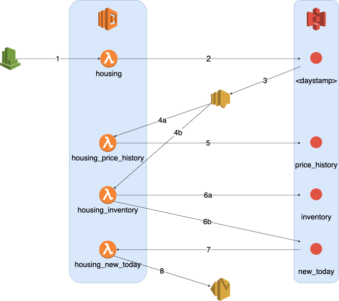

# housing

1. Cloudwatch triggers `housing` Lambda function daily at 6 AM
2. `housing` Lambda function scrapes available appartments and PUTs them in [`<daystamp>`](https://github.com/risteaandrei/housing/blob/master/data/20200214) S3 object
3. `<daystamp>` S3 PUT sends a notification to SNS
4. SNS triggers 2 Lambda functions:
   - a) `housing_price_history`
   - b) `housing_inventory`
5. `housing_price_history` Lambda function saves daily prices in [`price_history`](https://github.com/risteaandrei/housing/blob/master/data/price_history) S3 object
6. `housing_inventory` performs the following:
   - a) PUTs all appartments characteristics in [`inventory`](https://github.com/risteaandrei/housing/blob/master/data/inventory) S3 object
   - b) extracts newly posted appartments and PUTs them in [`new_today`](https://github.com/risteaandrei/housing/blob/master/data/new_today) S3 object
7. `new_today` S3 PUT triggers `housing_new_today` Lambda function
8. `housing_new_today` Lambda function sends an email containing a summary of new appartments, using SES service
